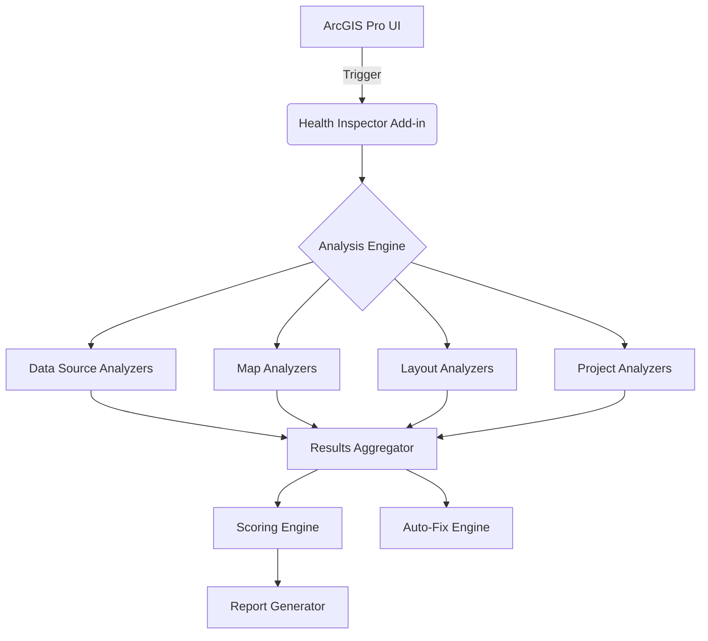

# ArcGIS Pro Project Health Inspector (APHI)
**"Grammarly for ArcGIS Pro Projects"**

ArcGIS Pro Project Health Inspector (APHI) is a comprehensive diagnostic and optimization add-in for Esri's ArcGIS Pro. It acts as an automated assistant that deeply analyzes your projects to identify broken links, performance bottlenecks, bloat, missing metadata, and other common issues.

## Features

APHI analyzes 20 distinct categories of project health, including:

1. **Broken Data Links**: Identifies missing or inaccessible datasets.
2. **Unused Layers**: Finds layers that are turned off or outside visible scales.
3. **Empty Groups**: Detects empty group layers.
4. **Coordinate System Mismatches**: Checks for discrepancies between layers and maps.
5. **Slow Web Services**: Flags sluggish REST endpoints or WMS/WFS services.
6. **Layout Clutter**: Highlights overlapping or misaligned layout elements.
7. **Missing Metadata**: Warns about layers or maps missing descriptions or tags.
8. **Geodatabase Bloat**: Detects excessively large file geodatabases.
9. **Symbol Complexity**: Flags overly complex symbology impacting draw times.
10. **Labeling Conflicts**: Identifies maps with too many or overlapping labels.
11. **Path Length Limits**: Warns of data paths approaching Windows limits.
12. **Deprecated Formats**: Highlights usage of shapefiles or personal geodatabases.
13. **Default Names**: Detects generic names like "Map", "Layout", or "Feature Class 1".
14. **Orphaned Layouts**: Finds layouts not referencing any map frames.
15. **Unused Connections**: Flags folder or database connections not used in the project.
16. **Version Conflicts**: Checks for enterprise geodatabase versioning issues.
17. **Bookmark Validity**: Verifies if spatial bookmarks have valid extents.
18. **Style Bloat**: Identifies large embedded styles unused in the project.
19. **Network Drive Latency**: Warns of layers hosted on slow network shares.
20. **Map Frame Empty**: Detects map frames that contain no visible data.

## Installation

### Manual Installation
1. Download the latest `.esriAddinX` file from the [Releases](https://github.com/yourrepo/releases) page.
2. Double-click the downloaded file.
3. Click **Install Add-In** in the Esri ArcGIS Add-In Installation Utility.
4. Restart ArcGIS Pro.

### Requirements
- ArcGIS Pro 3.3 or higher
- .NET 8 Desktop Runtime
- Windows 10 or 11

## Usage

1. Open an existing project in ArcGIS Pro.
2. Navigate to the **Health Inspector** tab on the ribbon.
3. Click **Run Analysis**.
4. The dockpane will display the analysis results and the overall Health Score.
5. Review the issues. Click an issue to see details.
6. For eligible issues, click the **Auto-Fix** button to resolve them automatically.

### Auto-Fix
Many issues support the Auto-Fix feature. APHI creates a save point before applying any fixes, ensuring you can undo changes if needed. A confirmation dialog will summarize the planned changes before execution.

### Health Score Methodology
The Health Score is calculated on a 0-100 scale:
- **98-100**: Excellent
- **84-97**: Good
- **67-83**: Fair
- **0-66**: Needs Attention

### Reports
You can export analysis results in various formats for compliance or record-keeping:
- HTML
- CSV
- JSON
- Text

## Configuration
Access settings via the **Options** button. Customize which analyzers run, set thresholds for warnings, and choose report output locations. See the [Configuration Guide](docs/configuration-guide.md) for details.

## Architecture

## Troubleshooting
See the [Troubleshooting Guide](docs/troubleshooting.md) for common issues.

## Roadmap
- Command-line interface for batch analysis
- Machine learning for predictive performance issues
- Custom analyzer plugin support

## Contributing
Please read [CONTRIBUTING.md](CONTRIBUTING.md) for details on our code of conduct and the process for submitting pull requests.

## License
This project is licensed under the MIT License - see the [LICENSE](LICENSE) file for details.

## Acknowledgments
- Esri for the ArcGIS Pro SDK
