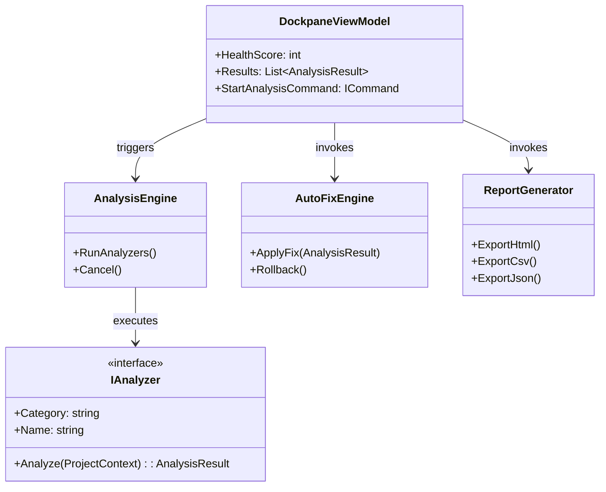
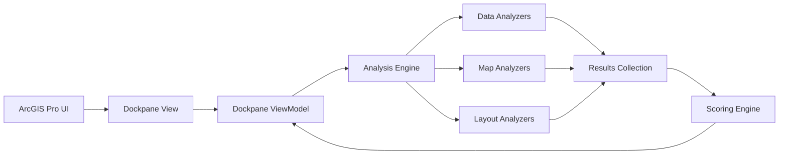
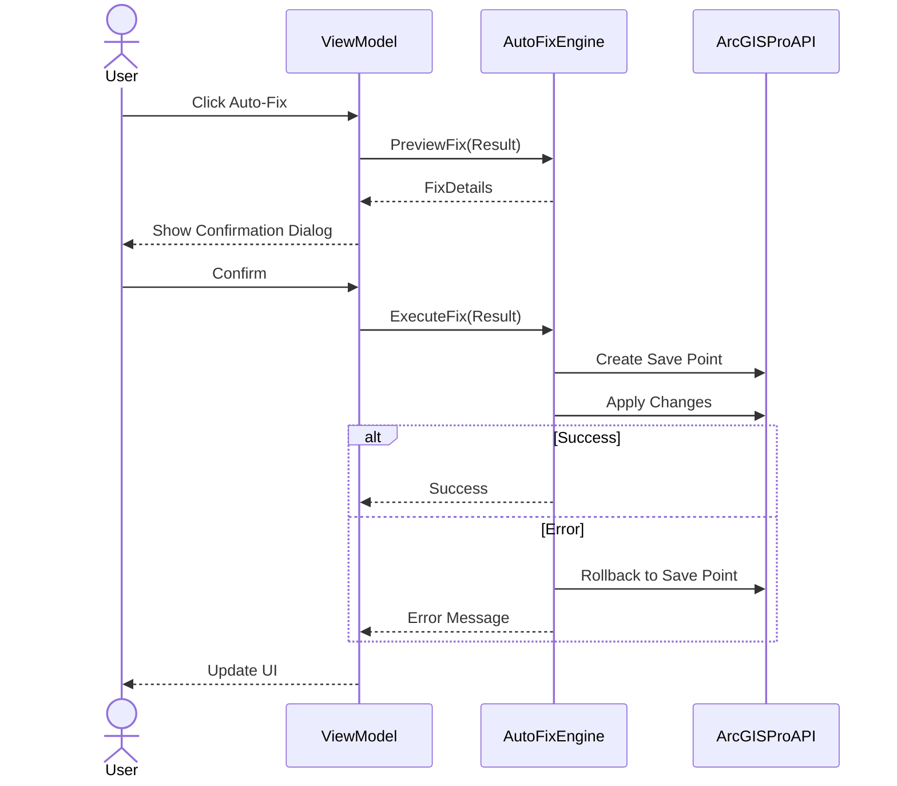

# Architecture Overview

This document describes the high-level architecture of the ArcGIS Pro Project Health Inspector (APHI).

## System Architecture

APHI is built as an ArcGIS Pro Add-in using the ArcGIS Pro SDK for .NET and WPF for the UI. It follows the MVVM (Model-View-ViewModel) design pattern.

## Component Flow

## Auto-Fix Workflow

The Auto-Fix workflow ensures safety by providing preview, confirmation, and rollback capabilities.

## Analyzers Pipeline

The Analysis Engine runs analyzers asynchronously, aggregating results as they complete. Each analyzer implements the `IAnalyzer` interface and operates on a read-only snapshot of the project state to avoid cross-thread UI blocking.
